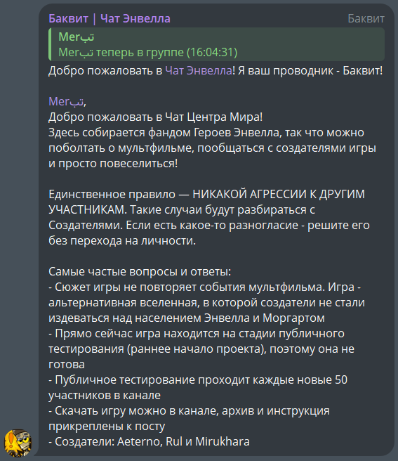
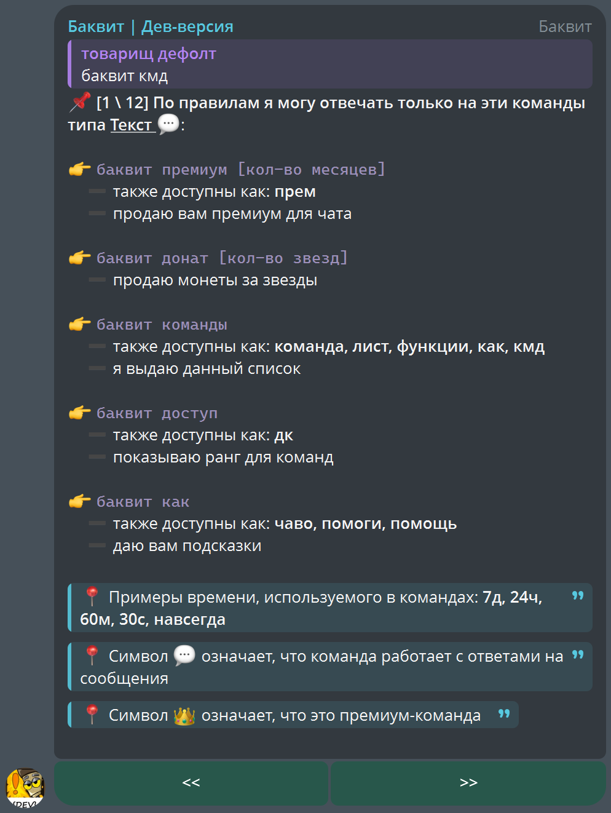

>  
> 
>  ***Добро пожаловать в Чат Энвелла, я ваш проводник - Баквит!***

Баквит - бот-администратор, созданный специально для чата https://t.me/envell_chat.

## Что умеет?

- **Приветствует новых игроков**
    - 
- **Умеет отвечать на команды:**
    - 
- **Имеет секретные команды**
    - 

## Как установить?

Баквит работает только в одном чате, в остальных он молчит.

Поэтому для работы в своем чате, нужно его захостить на своем компьютере или на сервере. Для этого **следуйте следующим пунктам**:

1. Установить последнюю версию *NodeJS*.
2. Установить последнюю версию *MongoDB*.
3. Скачать данный репозиторий, используя `git clone https://github.com/Rul991/buckwheat-bot` или через архив.
4. Переименовать `rename to .env` в `.env`
5. Получить токен через [@BotFather](https://t.me/BotFather)
6. Заполнить `.env`
   
    **Пример:**

    ```ini
    # полученный токен от @BotFather
    BOT_TOKEN = 1234567890:ABCDEFGHJKLMNOPQRSTUVWXYZabcdefghjk
    # название базы данных(можно ввести любое)
    DB_NAME = database 
    # можно оставить как тут, если mongodb установлен на тот же компьютер
    DB_URL = mongodb://localhost:27017
    # id чата
    CHAT_ID = -100000000000
    # твой id(не username) в тг
    DEV_ID = 1234567890 
    # оставить как тут
    MODE = prod
    ```

7. Ввести в консоль `npm run dev` или `npm start`
8. ...
9. **ПРОФИТ!**